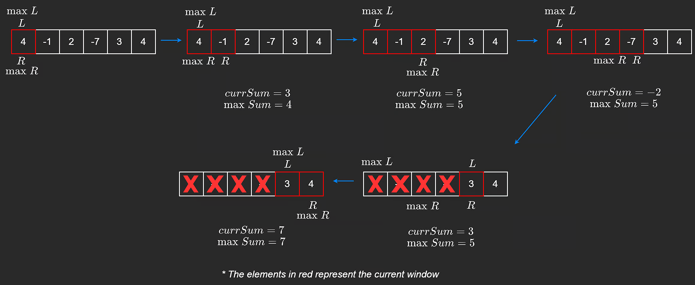

# Kadane's Algorithm

**Pattern:**  Sliding Window, Greedy, Dynamic Programming \
**Used On:** Substring, Subarray \
**TC:** O(n) \
**SC:** O(1) 

**Explaination**: \
Can be used on subarray and substring problems. It's both Greedy and DP because we keep a running sum of integers it interates through the subarray or substring. It's greedy because when the running sum becomes less than 0, we reset it to 0 (restart a new range as well) because adding a negative number does not help us get a larger sum. 


**Example:**  53. Maximum Subarray

Starting from the naive approach, we have two pointers (i and j). J interates from i until it visits all elements. After that, i is incremented, and j repeats the same process starting from the new ith position. 

As j is transversing the array, it keeps a running sum and records the largest sum it finds. 


```
/*
    Brute Force
    TC: O(n^2)
    SC: O(1)
*/

function maxSubArray(nums) {
    let maxSum = nums[0];

    for (let i = 0; i < nums.length; i += 1) {
        let curSum = 0;
        for (let j = i; j < nums.length; j += 1) {
            curSum += nums[j];
            maxSum = Math.max(curSum, maxSum);
        }
    }

    return maxSum;
};
```


Notice that as we go through this naive approach, the current element (pointer j) does not know what elements are at the left side of it. It only knows the running sum of all the elements before it. So, we can be greedy and decide not to add negative running sums because negative numbers does not help us get a max sum. We can decide to ignore the negative running sum and reset it to zero. Then add the current j-value to our running sum and compare it with the max recorded sum. This algorithm is known as Kadane's agorithm. 

```
// Kadane's algorithm

function maxSubArray(nums) {
    let maxSum = nums[0];
    let currentSum = 0;
    
    nums.forEach( num => {
        currentSum = Math.max(currentSum, 0);
        currentSum += num;       
        maxSum = Math.max(currentSum, maxSum);
    })
    
    return maxSum;
}; 

```


Kadane's agorithm is part of the sliding-window pattern. The two pointers (left and right) are implicitly created. The current pointer (within for-loop) is the right pointer. The left pointer start at index 0 and only moves when we get a running sum of zero and we have to reset it. Resenting the running sum moves the left-pointer to the position of the current pointer (right-pointer). 

The sliding window is noticiable if we modify the problem's output. Instead of returning the maxSum, we can return the a tuple containing the start and end indexes of the subarray containing the maxSum. 

```
// Kadane's algorithm, making sliding window noticeable

function maxSubArray(nums) {
    let maxSum = nums[0];
    let curSum = 0;
    const res = [0, 0];
    
    left = 0;
    for (let right = 0; right < nums.length; right += 1) {
        if (curSum < 0) {
            curSum = 0;
            left = right;
        }

        curSum += nums[right];       

        if (curSum > maxSum) {
            maxSum = curSum;
            res[0] = left;
            res[1] = right
        }
    }

    return res;
}; 

```


{Illustration from Neetcode}

## Related Problems 

Subarray \
1.   Maximum Subarray
    
Substring \
54.  Permutation In String
55. Longst Substring without Repeating Characters
    


## References
[NeetCode Kadane's Agorithm](https://neetcode.io/courses/advanced-algorithms/0)